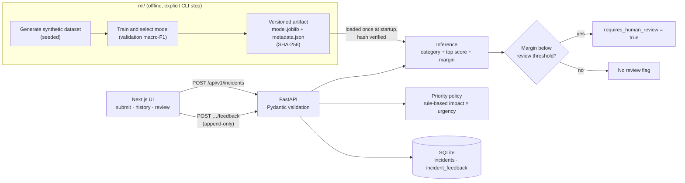

# IncidentIQ

[](https://github.com/MurayaSoftTouch/IncidentIQ/actions/workflows/ci.yml)

Intelligent incident triage: submit a software incident report, get a
category prediction, an advisory escalation priority, a clear signal for
when human review is required, and a place for a human reviewer to confirm
or correct that prediction.

The point of the project is the engineering around the model, not the model
itself: a leakage-aware evaluation, hash-verified model artifacts, honest
uncertainty reporting, a human-review path, and a priority policy that is
deliberately *not* machine-learned.

## How it works



A submitted incident is validated, classified by the loaded model, checked
against the review threshold, given an advisory priority by a separate rule
policy, and stored together with all of those outputs. Reviewers can then
confirm or correct the category and priority; each review is a new row and
never overwrites the original prediction.

| Concern | What the code does | Where |
|---|---|---|
| Classification | TF-IDF + Logistic Regression over 8 incident categories, chosen against Dummy and Naive Bayes baselines on validation macro-F1 | `ml/src/incidentiq_ml/models/train.py` |
| Leakage control | 70/15/15 split ordered by time and grouped by near-duplicate cluster, so near-duplicates never cross splits; the test set is scored once, after selection | `ml/src/incidentiq_ml/data/split.py`, `dedup_audit.py` |
| Uncertainty | Returns the top-class score and the margin to the second class; every response is labelled `confidence_status: "uncalibrated"` | `backend/app/ml_runtime.py`, `schemas.py` |
| Human review | `requires_human_review` when the margin is below `INCIDENTIQ_REVIEW_MARGIN_THRESHOLD` (default 0.20, a documented heuristic) | `backend/app/config.py`, `ml_runtime.py` |
| Priority | Advisory P1–P4 from impact × urgency, `undetermined` when inputs are missing; never predicted by the model | `backend/app/priority_policy.py`, [`docs/priority_policy.md`](docs/priority_policy.md) |
| Artifact integrity | The backend refuses to serve a model whose metadata or SHA-256 doesn't match | `backend/app/ml_runtime.py` |
| Reproducibility | Fixed seed for data generation and training; the artifact is rebuilt from source in CI and inside the backend Docker image | `ml/src/incidentiq_ml/config.py`, `backend/Dockerfile` |

More detail: [architecture](docs/architecture.md) ·
[model card](docs/model_card.md) ·
[dataset decision](docs/dataset_decision.md) ·
[priority policy](docs/priority_policy.md).

## Status

- **M1 (Foundation & ML)** — done. See [`docs/dataset_decision.md`](docs/dataset_decision.md)
  and [`docs/model_card.md`](docs/model_card.md).
- **M2 (Full-stack vertical slice)** — done. FastAPI backend + Next.js
  frontend, real inference end-to-end, no mocks. See
  [`docs/architecture.md`](docs/architecture.md) and
  [`docs/priority_policy.md`](docs/priority_policy.md).
- **M3 (Release readiness)** — done. Human-review feedback workflow,
  Docker Compose, and GitHub Actions CI (`.github/workflows/ci.yml`,
  running on every PR to and push to `main`). See the M3 issue in the project tracker
  for the original scope and acceptance criteria.

## Repository layout

```
IncidentIQ/
├── ml/          # Offline training package (scikit-learn). Never imported by the API at runtime.
├── backend/     # FastAPI service — inference, priority policy, feedback, persistence
├── frontend/    # Next.js app — submission, prediction display, history, review feedback
├── docs/        # Architecture, dataset provenance, model card, priority policy
└── .github/workflows/ci.yml  # CI: ml/backend/frontend tests + e2e, on PRs and pushes to main
```

## Run the whole stack

### Option A: locally, three terminals (in this order)

Each subproject has its own `README.md` with more detail.

```bash
# 1. ML — produces the artifact the backend loads
cd ml
uv venv --python python3.10 && uv pip install -e ".[dev]"
uv run python scripts/generate_dataset.py
uv run python scripts/train.py

# 2. Backend
cd backend
uv venv --python python3.10 && uv pip install -e ".[dev]"
uv run uvicorn app.main:app --reload --port 8000

# 3. Frontend
cd frontend
npm install
cp .env.local.example .env.local
npm run dev
```

Open `http://localhost:3000`.

### Option B: Docker Compose

```bash
docker compose build   # builds the model artifact inside the backend image (see backend/Dockerfile) — never at container startup
docker compose up -d
```

Open `http://localhost:3000`. `docker compose ps` should show the backend
as `healthy` (its `/ready` endpoint is the health check). Incident data
persists in the `incidentiq-data` named volume across `docker compose
restart`/`down`+`up` — verified directly during development: an incident and
its feedback survived a real `docker compose restart backend`, confirmed by
re-fetching them afterward, not just claimed.

`NEXT_PUBLIC_API_BASE_URL` is baked into the frontend's client bundle at
**build** time and must be reachable from the *browser*, not from inside
the Docker network — with the default port mapping (backend published on
`localhost:8000`) the default in `docker-compose.yml` is already correct.
If you change the backend's published port, pass a matching
`--build-arg NEXT_PUBLIC_API_BASE_URL=...` (or edit the compose file).

This is a local demonstration setup — no TLS, no authentication. Don't
expose these containers to the public internet as-is.

## Test

```bash
cd ml && uv run pytest          # 16 tests
cd backend && uv run pytest     # 40 tests
cd frontend && npm run test:e2e # 10 tests — real browser, real backend, real model, disposable DB
```

`.github/workflows/ci.yml` runs all of the above on every PR to `main` and on
pushes to `main`,
plus frontend lint and a production build (which includes TypeScript
checking).

## The feedback workflow

`POST /api/v1/incidents/{id}/feedback` records a human review: confirm or
correct the predicted category, confirm or correct the priority, an
optional note, an optional (explicitly unverified — there's no auth)
reviewer name. Feedback is **append-only** — it never overwrites the
original prediction or a prior review, so `GET /api/v1/incidents/{id}`
returns both the untouched original prediction and the full feedback
history side by side. Submitting feedback does **not** trigger retraining;
there is no automated pipeline connecting reviewer corrections back into
the model. See `docs/architecture.md` for the schema and
`backend/tests/test_feedback.py` for the behavior this guarantees
(immutability of the original prediction, repeated feedback retained as
history, safe against a pre-existing/older database).

## Known limitations

- **Synthetic training data.** No real incident dataset was used — three
  candidates were investigated and rejected for license/schema/access
  reasons (full audit in `docs/dataset_decision.md`). Reported metrics
  (~0.89 test macro F1) demonstrate the pipeline works, not real-world
  accuracy, and are themselves a development-stage result (the generator
  was iterated after seeing an earlier test score — see the
  "evaluation-independence caveat" in that doc).
- **Uncalibrated confidence.** Raw model scores are surfaced but always
  labeled `confidence_status: "uncalibrated"`, never presented as a
  validated confidence percentage.
- **Heuristic review threshold.** The 0.20 margin threshold that flags a
  prediction for human review is a documented placeholder, not
  statistically derived.
- **Feedback doesn't feed back.** The workflow captures human corrections,
  but nothing consumes them yet — no retraining, no drift monitoring, no
  reviewer-agreement metrics.
- **No authentication.** Reviewer names in feedback are free text, not a
  verified identity. This is a local-run demo application, not a hardened
  deployment — the Docker Compose setup is for local use, not public
  hosting.
- **Minor API contract inconsistency:** 422 validation errors use FastAPI's
  default `{"detail": [...]}` shape, while other errors use this project's
  `{"error_code", "detail"}` shape. The frontend client handles both; this
  is a documented rough edge, not a functional bug.
- **No request body size limit** beyond individual field length caps
  (a Starlette/FastAPI default gap, not specific to this app).
